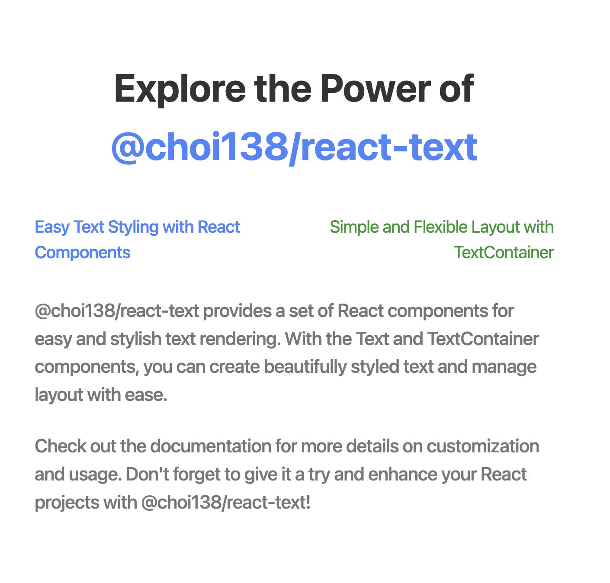

# @choi138/react-text



## Installation

```sh
npm install @emotion/react @emotion/styled
npm install @choi138/react-text
```

## Example

### Demo

```tsx
import React from 'react';

import { Text } from '@choi138/react-text';

function App() {
  return (
    <div>
      <Text size={1.1} weight={500} color="#4785FA">
        Easy Text Styling with React Components
      </Text>
    </div>
  );
}

export default App;
```

### Use Cases

####

```tsx
import React from 'react';

import { Text, TextContainer } from '@choi138/react-text';

function App() {
  return (
    <TextContainer flexDirection="column" columnGap={0.6}>
      <Text size={1.1} weight={500} color="#4785FA">
        Easy Text Styling with React Components
      </Text>
      <Text size={1.1} weight={500} color="#279632">
        Simple and Flexible Layout with TextContainer
      </Text>
    </TextContainer>
  );
}
```

## API Reference

### TextOptions

| Required | Key        | Type                                          | Default Value | Description      |
| :------: | ---------- | --------------------------------------------- | ------------- | ---------------- |
|    ✅    | children   | React.ReactNode                               | none          | Text content     |
|    ❌    | size       | number                                        | 1.1           | Text rem size    |
|    ❌    | weight     | number                                        | 500           | Text weight      |
|    ❌    | color      | string                                        | #000000       | Text color       |
|    ❌    | lineHeight | number                                        | auto          | Text line height |
|    ❌    | cursor     | React.CSSProperties['cursor']                 | auto          | Text cursor      |
|    ❌    | textAlign  | React.CSSProperties['textAlign']              | left          | Text align       |
|    ❌    | style      | React.CSSProperties                           | undefined     | Text style       |
|    ❌    | onClick    | React.MouseEventHandler<HTMLParagraphElement> | undefined     | Text onClick     |

### TextContainerOptions

| Required | Key            | Type                                          | Default Value | Description                    |
| :------: | -------------- | --------------------------------------------- | ------------- | ------------------------------ |
|    ✅    | children       | React.ReactNode                               | none          | Text Container content         |
|    ❌    | columnGap      | React.CSSProperties['columnGap']              | 0             | Text Container column gap      |
|    ❌    | rowGap         | React.CSSProperties['rowGap']                 | 0             | Text Container row gap         |
|    ❌    | flexDirection  | React.CSSProperties['flexDirection']          | auto          | Text Container flex direction  |
|    ❌    | justifyContent | React.CSSProperties['justifyContent']         | auto          | Text Container justify content |
|    ❌    | alignItems     | React.CSSProperties['alignItems']             | auto          | Text Container align items     |
|    ❌    | style          | React.CSSProperties                           | undefined     | Text Container style           |
|    ❌    | onClick        | React.MouseEventHandler<HTMLParagraphElement> | undefined     | Text Container onClick         |
